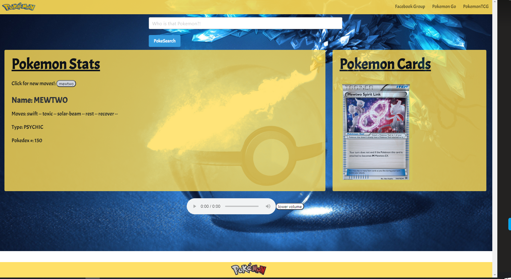

# furry-bassoon

# All Things Pokemon / furry-bassoon

## About

- A fully functional and responsive application that searches multiple Pokemon API’s to display specific Pokemon cards and gaming statistics.
- Project status: working/prototype

## User Story

- Any game player or fan of Pokemon wanting more information on any Pokemon character will be able to access our application to search Pokemon and their cards/statistics. User enters a Pokemon name in the search form, upon clicking “PokeSearch” the user will be able to view that specific Pokemon’s actual playing card along with its name, move, type and pokedex number.

## Table of contents

> - [Title / Repository Name](#title--repository-name)
>   - [About](#about--synopsis)
>   - [User Story](#user-story)
>   - [Table of contents](#table-of-contents)
>   - [Deploy](#deploy)
>   - [Screenshots](#screenshots)
>   - [Technologies Used](#technologies-used)
>   - [Future Development](#future-development)
>   - [Resources](#resources)
>   - [Contributers](#contributers)
>   - [License](#license)

## Deploy

To access the application please click the link below. No requirements for installation or downloads.

## Screenshots

## Technologies Used

## Future Development

- Including all generations of cards available to date or adding new cards
- Including more data for users who play the game more competitively
- Adding new feature sets and styling

## Resources

- TA: Trenton and Jeff
- https://pokeapi.co/
- https://pokemontcg.io/
- https://bulma.io/documentation/
- w3schools

## Contributers

- Garrett Steed
- Alexander Leal
- Ashley Bartholomew
- Devyn Bailey
